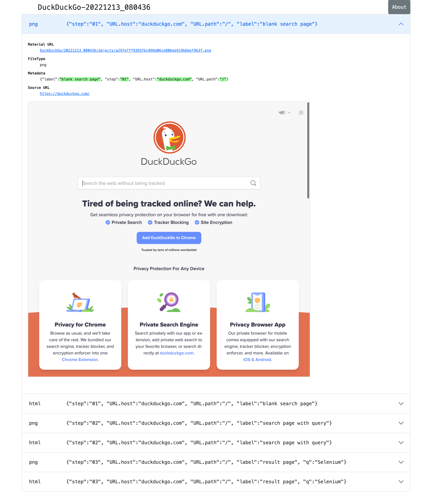

Selenium WebDriverは Webブラウザに表示された画面 view port のスクリーンショットを撮ってファイルに保存するクラスとメソッドを提供しています。たとえば link:https://www.guru99.com/take-screenshot-selenium-webdriver.html[Guru99] の記事を参照のこと。Katalon Studioも link:https://docs.katalon.com/docs/legacy/katalon-studio-enterprise/keywords/web-ui-keywords/webui-take-full-page-screenshot#takefullpagescreenshot[WebUI.takeFullPageScreenshot] キーワードを提供しているが、これは実はSelenium WebDriverのクラスとメソッドを利用したラッパーです。これらのメソッドを使えばたしかにWebサイトのページをキャプチャしてPNG画像ファイルにすることはできます。

ところが実際に自分のwebシステムを標的にしてたくさんキャプチャして一覧する資料を作りたいと望んでコードを書き始めたとたん面倒だとわかる。Katalon Studioのプロジェクトで `WebUI.takeFullPageScreenshot` を
呼び出すコードは例えば下記のようなものです。

[source,java]
----
WebUI.takeFullPageScreenshot('C:\\Users\\kazurayam\\tmp\\screenshots\\page1.png')
----

この1行から次の２つの問題点が浮かび上がってきます。

第一に、Katalon StudioやSelenium WebDriverライブラリは画像の保存先であるファイルを管理してくれない、ということ。どのフォルダにどういう名前のファイルを作るかは呼び出し元であるテストスクリプトが決定しなければならない。フォルダが未だ存在していなければテストスクリプトがフォルダをあらかじめ作ってやらなければならない。WebDriverのメソッドを使う場合でも同様。WebDriverはスクリーンショットのバイト列を返してくれるが、そのバイト列をどこにどう保存するかには関与しない。だからあなたは画像を保存するためのフォルダを作ったり、適切なファイル名を付与したりできるようにテストスクリプトを作り込まなければならない。ただのファイル操作ですから技術的に高度ではない。しかし面倒なコーディングです。

第二に、webからダウンロードしたファイルに関するメタデータを保存できない、ということ。わたしが書いたテストスクリプトが`WebUI.takeFullPageScreenshot` キーワードを使って `http://demoaut-mimic.kazurayam.com` というURLのスクリーンショットを撮り、PNG画像を `page1.png` という名前のファイルに保存したとします。次に別のスクリプトが実行されて、 `page1.png` ファイルを読んで一覧表を生成したと考えてください。 `page1.png` ファイルがもともとは `http://demoaut-mimic.kazurayam.com` というURLのスクリーンショットであるということを二番目のスクリプトが知って一覧表に印字することはできるでしょうか？ --- フツー、できません。PNG画像ファイルの中にメタデータを追記することはできません。ファイルの名前を元のURLと似た名前にすればいいんじゃないの？--- いやいや、それも無理。URLの中には `:` や `/` や `?` や `&` のようにファイルのパスの一部として使えない文字が必ず含まれるから。また、URLの中にはとんでもなく長いURLが存在しうる。例えば

[source,text]
----
https://www.google.com/search?q=selenium&sxsrf=ALiCzsYKAI-jaC5MM2yaKFVKvzIcncqg6w%3A1671499947697&source=hp&ei=qxChY877J9bJ2roP9pGymA0&iflsig=AJiK0e8AAAAAY6Eeu3zqRgAHDKzS5EIa6SZ73xNrdDyN&ved=0ahUKEwiO_fzEhof8AhXWpFYBHfaIDNMQ4dUDCAg&uact=5&oq=selenium&gs_lcp=Cgdnd3Mtd2l6EAMyBAgjECcyCAgAEIAEEMsBMggIABCABBDLATIICAAQgAQQywEyCAgAEIAEEMsBMggIABCABBDLATIICAAQgAQQywEyCAgAEIAEEMsBMggIABCABBDLATIICAAQgAQQywE6BwgjEOoCECc6CwguEIAEEMcBENEDOgUILhCABDoFCAAQgAQ6CAguEIAEENQCOggILhCABBDLAVDdAliHC2D-DGgBcAB4AIABrQGIAeoIkgEDMC44mAEAoAEBsAEK&sclient=gws-wiz
----

のように。こんな長いURLを化かしてファイルのパスにしたらとんでもないことになる。Windowsエクスプローラのファイルツリーにこんな長い名前のファイルが現れたら扱いにくくてしょうがない。また link:https://learn.microsoft.com/en-us/windows/win32/fileio/maximum-file-path-limitation?tabs=registry[Windows APIのファイルパスが最長260文字までという制限] に引っかかってプログラムがエラーになるかもしれない。

これら二つの問題を根本的に解決するためにわたしはライブラリを自作しました。

* link:https://github.com/kazurayam/materialstore-tutorial[materialstore]

materialstoreライブラリを使うことによって、スクリーンショット画像を複数たくさん撮り、それらを一覧するHTMLを作ることが簡単になりました。下記のURLをご覧あれ。

* link:https://kazurayam.github.io/inspectus4katalon-sample-project/demo/store/DuckDuckGo-20221213_080436.html[DuckDuckGoのスクリーンショットの一覧]

== 概念

=== Materialクラス

画面を検査することを目的に link:https://www.selenium.dev/documentation/webdriver/[Selenium WebDriver] や link:https://appium.io/[Appium] や []

=== diff ratio, FileType, Metadata

二つのファイルと差分ファイルをまとめた組のことを link:https://github.com/kazurayam/materialstore/blob/main/src/main/java/com/kazurayam/materialstore/base/reduce/zipper/MaterialProduct.java[MaterialProduct] というclassで表します。レポートの中に下記のような表示がありますが、これは Material Product の属性情報です。

image:https://kazurayam.github.io/inspectus4katalon-sample-project/images/diffratio-fileType-metadata.png[width=60%]

左上の `0.14%` という数字を **diff ratio** と呼びます。画面の四角形全体の大きさを100.00%として、赤く塗られた差分箇所が何パーセントを占めているかを表しています。"0.14%"という例は "完全に同じではない、ちょっとだけ違っている" と読める。diff ratioがが 96.0% とか大きな値になることもあり得ます。きっと何かエラーが発生した印でしょう。

diff ratioの次にある `png` というのは、link:https://github.com/kazurayam/materialstore/blob/main/src/main/java/com/kazurayam/materialstore/core/filesystem/FileType.java[FileType] つまりファイルの種類を表す記号です。`png` はPNG画像ファイルを表し、`html` はHTMLテキストファイルを表します。

FileTypeの次に少し長い文字列が続きます。

[source,text]
----
{"step:"01", "profile":"ProductionEnv", "URL.host":"demoaut-mimic.kazurayam.com", "URL.path":"/", "URL.port":"80", "URL.protocol":"http"}
----

この文字列を link:https://github.com/kazurayam/materialstore/blob/main/src/main/java/com/kazurayam/materialstore/core/filesystem/QueryOnMetadata.java[Metadata] メタデータと呼びます。２つのスクリーショット画像と差分画像の組について付加された説明です。

Visual Inspectionのソフトウェアは特殊なファイルシステムを装備しています。そのファイルシステムをわたしは link:https://github.com/kazurayam/materialstore/tree/main/src/main/java/com/kazurayam/materialstore/core/filesystem[materialstore] と呼んでいます。`materialstore` を使えばWeb画面のスクリーンショットやHTMLソースに対してURLをはじめとする任意のメタデータを付与してローカルディスクに保存することができます。そしてメタデータをキーとして検索してファイルを取り出すことができます。materialstore はVisual Inspectionを実装するために設計された問題特化型データベースですです。

=== Chronos Diff

Visual InspectionはひとつのWebサイトのスクリーンショットを２回撮って前後の画面を見比べることができます。link:http://demoaut-mimic.kazurayam.com/[] というテスト用のURLを標的に前後比較をしたとき出力されたレポートが下記のものです。このURLの画面の中には現在時刻が表示されている（例えば `2022/12/19 1:5:8 UTC`）ので、スクリーンショットを2度に分けて撮れば微小ながら必ず差異が生じます。レポートが画像の差異をレポートしてくれていることを見てください。

- link:https://kazurayam.github.io/inspectus4katalon-sample-project/demo/store/CURA-20221213_080716.html[CURA 1回目]
- link:https://kazurayam.github.io/inspectus4katalon-sample-project/demo/store/CURA-20221213_080831.html[CURA 2回目]

次の図はこのレポートがどのような内部処理によって作成されたかを示しています。

image:https://kazurayam.github.io/inspectus4katalon-sample-project/diagrams/out/activity-chronosdiff-ja/activity-chronosdiff-ja.png[activity cura]

image:https://kazurayam.github.io/inspectus4katalon-sample-project/diagrams/out/chronos

=== Twins Diff: Webサイトの本番環境と開発環境を比較する

- [MyAdmin](https://kazurayam.github.io/inspectus4katalon-sample-project/demo/store/MyAdmin-20221213_080556.html)

前述したChronos DiffはひとつのWebサイトを違うタイミングで2回スナップショットしましたが、Twins Diffは違います。Twins Diffを実行する際にはwebサイトの本番環境と開発環境のようにURLの中のホスト名部分が違う２つのURLを与えます。例えば

* `http://myadmin.kazurayam.com/` (本番環境)
* `http://devadmin.kazurayam.com/` (開発環境)

のように。そしてサイトを構成するページのURLのパス部分を列挙したCSVファイルを与えます。例えば

[source,text]
----
include:../Include/data/MyAdmin/targetList.csv
----

のように。

Twins Diffは指定されたURLのホスト名とCSVファイルから読み取ったパス文字列を合成してURLを特定します。そしてそのURLをブラウザで開いてスクリーンショットを撮ります。URLのパス文字列が一致する画像どおしを比較して差分を求めレポートを作成します。

link:https://kazurayam.github.io/inspectus4katalon-sample-project/diagrams/out/activity-twinsdiff-ja/activity-twinsdiff-ja.png![activity twins]

=== Shootings

画像を比較して差分を求めるような高度な加工をせず、ただスクリーンショットを撮って、それを一覧表示したいだけ、という場合があるでしょう。そのとき役立つツールもあります。

* link:https://kazurayam.github.io/inspectus4katalon-sample-project/demo/store/DuckDuckGo-20221213_080436.html[DuckDuckGo]

検索サービス link:https://duckduckgo.com/[DuckDuckGo] をブラウザで開き、キーワードとして "selenium" を指定して、関連するサイトの一覧を求める。web画面のスクリーンショットを取得してPNG画像としてローカルディスクに保存し、ついでにweb画面のHTMLソースコードも保存する。各画面のURLなどのメタ情報も記録する。ファイルの一覧を表示するHTMLを生成しました。

== Visual Inspectionを動かしてみよう

== 雑談

=== Visual Inspection とは何か

_Visual Inspection_ は人間がWebサイトの画面をブラウザで開いてたくさんのページを眺めて *どこかおかしなところはないか?* と目視で確認する、その作業をツールで自動化することを目的とするツールです。よく似た別の言葉 "Visual Testing" をキーワードにGoogle検索すると商用ソフトウェア製品やサービスがいくつも見つかります。例えば

* link:https://www.browserstack.com/guide/visual-testing-beginners-guide[browserstack]
* link:https://applitools.com/learn/concepts/visual-testing/[applitool]
* link:https://katalon.com/visual-testing[katalon's Visual Testing]

しかし Visual Inspection をGoogle検索しても何も出てきません。無理もない。わたしが「画面確認の自動化」をアルファベットで表記するために作った造語だから。

_Testing_ とはあらかじめ条件を特定しておき対象となるソフトウェアが期待通りに動作するかどうかを確認することと定義しましょう。いっぽう _Inspection 検査_ とはWebシステムが提供する画面をできるだけたくさん眺める。そして「おや、これは何だ？」と不審な箇所を発見することを目指します。InspectionはTestingとは違う目的を持っています。

=== Visual Inspectionは誰のためのツールか

link:https://qiita.com/[Qiita]の読者の大半は現役プログラマであり、ソフトウエアの開発を本職としている人たちでしょう。Visual Inspectionは彼らプロのためのツールではありません。IT系じゃない一般企業に就職した新人君が、上司から

>「ウチのこのWebサイトにおかしなところが無いかどうか、全部のページを目で見て確認してくれ。」

といわれた。そういう新人君は毎年何千人もいるだろう。Visual Inspectionはこうした新人君の作業を楽にするためのツールです。

新人君はまだプログラミングの訓練を受けていない、Webサイトを実現しているIT技術のこと（ReactとかSpringとか...）はわからない。新人君が配属された部署は、SIerが開発して納品したソフトウェアを受け取って、できるかぎり動作確認して、稼働環境に投入して、自社のWebサービスを継続的に運転していく責任がある。本番としてリリースした画面に問題があってサイト利用者から指摘されたら、さあ大変。新人君はそうならないように画面確認作業を繰り返す。しかし画面確認は正直いって面倒くさいし面白くない。せめて注目すべき箇所を見つけ出すぐらいのことは自動化したい。・・・Visual Inspectionはこの新人君のためのツールです。

=== Visual Inspectionと商用製品・サービスとの違い

==== 自社のデータを社外に出すことの是非

Katalon Studioにも link:https://katalon.com/visual-testing[Visual Testing] のサービスが組み込まれています。このサービスはテストが生成したファイルをインターネット経由でKatalon社のサービスへ出力しサーバサイドで画像比較とレポート出力をするという形を取ります。わたしが各社のwebサイトの説明を読んだかぎりApplitoolsをはじめとするVisual Testingサービスは皆同じでした。ユーザーが所属する企業が社内情報が漏洩するリスクを嫌って自社データを社外に出力することを禁止している場合、商用のVisual Testingサービスを導入するのは無理です。

いっぽうわたしの開発したVisual Inspecton for Katalon StudioはあなたのPCの上で完結します。結果として生成したファイルをローカルディスクに出力するにとどまります。テストが生成したファイルをインターネット経由で他社が管理するクラウドストレージに出力することを必須としません。だから企業の情報セキュリティの壁を崩す心配がありません。

==== データ転送にかかる時間

一つのwebサイトを画面確認しようとして200画面分スクリーンショットを撮ったとします。Visual Inspection for Katalon StudioはPNGファイルをローカルディスクに保存して処理するので、さほど時間はかかりません。いっぽう商用サービスは多数の画像ファイルをPCからリモートのサーバーへネットワーク経由で転送します。あたなが使えるネットワークの速度に依存しますが、画像ファイルを転送するためだけに何分も時間がかかるであろうことは予想できます。

==== Chronos DiffはよそにもあるがTwins Diffはここだけ

わたしのツールはChronos DiffとTwins Diffの2通りの比較方式をサポートしています。

Chronos Diffとは、一つのURLについて時間間隔をおいて二度スナップショットを撮ったものを比較します。あなたのwebシステムの本番環境のスナップショットを午後１５時に取得し、入替等の作業をしてから、午後１６時にもう一度同じ環境のスナップショットをとる、そして作業の前後を比較して不慮のミスを犯していないかどうかを確認するような使い方ができます。

image:https://kazurayam.github.io/inspectus4katalon-sample-project/diagrams/out/activity-chronosdiff-ja/activity-chronosdiff-ja.png[activity ChronosDiff]

いっぽうTwins Diffとはあなたのwebシステムが2つの環境を持っていてトップページのURLのホスト名だけが違っているとして、2つの環境のスナップショットをほぼ同じタイミングで取得し、二つのスナップショット画像をうまく突き合わせて比較する、という目的に向いています。例えば 本番環境 `myadmin.kazurayam.com` と 開発環境 `devadmin.kazurayam.com` を比較することができます。元となるURLのホスト名が同一ではないスナップショットを*うまく突き合わせ*て組にするためのルールを組み立てる必要があって、ちょっと複雑にならざるを得ないのですが、わたしのツールはサポートしています。

image:https://kazurayam.github.io/inspectus4katalon-sample-project/diagrams/out/activity-twinsdiff-ja/activity-twinsdiff-ja.png[activity TwinsDiff]()

世の中のVisual Testing製品が実現しているのは、わたしのツールがChronos Diffと呼んでいるものだけです。**Twins Diffを実現している製品はわたしの見るところ他にありません。**

=== オープンソース、無償利用可能であること

Visual Inspectionはわたしが開発したオープンソースのソフトウェアライブラリ2つによって実装されています。

. link:https://github.com/kazurayam/materialstore[kazurayam/materialstore]
. link:https://github.com/kazurayam/inspectus[kazurayam/inspectus]

これらはApache2ライセンスを適用しており無償で利用可能です。従ってVisual Inspectionもオープンソースであり無償で利用可能です。

=== Katalon Studioが必須ではない

今回紹介したデモは link:https://katalon.com/download[Katalon Studio]を使って、Katalon Studioのプロジェクトとして作成しました。しかし上記に示したライブラリ(materialstoreとinspectus)はKatalon StudioのAPIにまったく依存していません。だからKatalon Studio無しでVisual Inspectionのプロジェクトを構成することができます。Java8 + Gradle + Selenium WebDriver で構成したVisual Inspectionプロジェクトの例が下記にあります。

. link:https://github.com/kazurayam/inspectus4selenium-sample-project[]

こちらのプロジェクトを説明するのはまた別の機会に。
