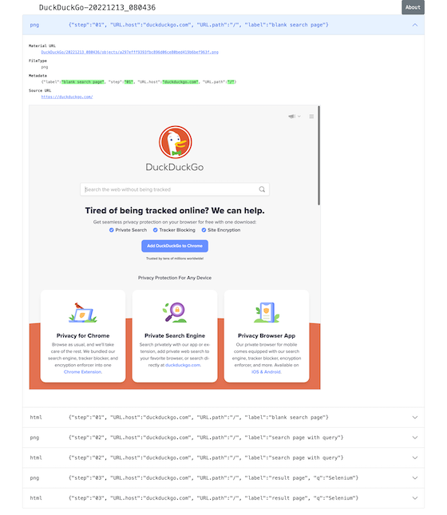

-   <a href="#visual-inspection-webサイトの画面確認を自動化しよう" id="toc-visual-inspection-webサイトの画面確認を自動化しよう">Visual Inspection : Webサイトの画面確認を自動化しよう</a>
    -   <a href="#はじめに" id="toc-はじめに">はじめに</a>
    -   <a href="#visual-inspectionが出力するレポートのサンプル" id="toc-visual-inspectionが出力するレポートのサンプル">Visual Inspectionが出力するレポートのサンプル</a>
    -   <a href="#サンプルの説明" id="toc-サンプルの説明">サンプルの説明</a>
        -   <a href="#二つの画像の差分" id="toc-二つの画像の差分">二つの画像の差分</a>
        -   <a href="#二つのテキストの差分" id="toc-二つのテキストの差分">二つのテキストの差分</a>
        -   <a href="#スクリーンショットの一覧" id="toc-スクリーンショットの一覧">スクリーンショットの一覧</a>
    -   <a href="#visual-inspectionのサンプルプロジェクトを動かしてみる" id="toc-visual-inspectionのサンプルプロジェクトを動かしてみる">Visual Inspectionのサンプル・プロジェクトを動かしてみる</a>
        -   <a href="#katalon-studioを準備する" id="toc-katalon-studioを準備する">Katalon Studioを準備する</a>
            -   <a href="#katalon-studioをインストールする" id="toc-katalon-studioをインストールする">Katalon Studioをインストールする</a>
            -   <a href="#katalon-studioのguiを起動してユーザー登録をする" id="toc-katalon-studioのguiを起動してユーザー登録をする">Katalon StudioのGUIを起動してユーザー登録をする</a>
            -   <a href="#katalon-studioを設定する" id="toc-katalon-studioを設定する">Katalon Studioを設定する</a>
                -   <a href="#proxyを設定する" id="toc-proxyを設定する">Proxyを設定する</a>
                -   <a href="#webdriverをアップデートする" id="toc-webdriverをアップデートする">WebDriverをアップデートする</a>
                -   <a href="#scrip-viewを使うmanual-viewを使わない" id="toc-scrip-viewを使うmanual-viewを使わない">Scrip viewを使う、Manual viewを使わない</a>
            -   <a href="#プロジェクトを作る" id="toc-プロジェクトを作る">プロジェクトを作る</a>
            -   <a href="#プロジェクトを設定する" id="toc-プロジェクトを設定する">プロジェクトを設定する</a>
                -   <a href="#ブラウザの種類を選ぶ" id="toc-ブラウザの種類を選ぶ">ブラウザの種類を選ぶ</a>
                -   <a href="#testopsをintegrateしない" id="toc-testopsをintegrateしない">TestOpsをintegrateしない</a>
                -   <a href="#testcloudをintegrateしない" id="toc-testcloudをintegrateしない">TestCloudをintegrateしない</a>
                -   <a href="#smart-waitを使わない" id="toc-smart-waitを使わない">Smart Waitを使わない</a>
                -   <a href="#log-viewerを軽量化する" id="toc-log-viewerを軽量化する">Log Viewerを軽量化する</a>
            -   <a href="#初めてのtest-caseを作って動かしてみる" id="toc-初めてのtest-caseを作って動かしてみる">初めてのTest Caseを作って動かしてみる</a>
        -   <a href="#visual-inspectionのサンプルコードをダウンロードする" id="toc-visual-inspectionのサンプルコードをダウンロードする">Visual Inspectionのサンプル・コードをダウンロードする</a>
        -   <a href="#git-for-windowsをインストールする" id="toc-git-for-windowsをインストールする">Git for Windowsをインストールする</a>

# Visual Inspection : Webサイトの画面確認を自動化しよう

## はじめに

わたしはWebアプリケーションのUIをテストとする作業をソフトウェアで自動化する技術に関心があります。わたしは2018年9月に [Katalon Studio](https://katalon.com/katalon-studio)というUIテスト自動化ツールの体験記をQiitaに投稿しました。

-   [Katalon StudioでVisual Testingを実現した](https://qiita.com/kazurayam/items/bcf72a03f50fc5db4373)

この成果物にはいろいろ不満がありました。わたしはその後も開発を続けて、ようやく使い物になるツールに仕立てることができた。このツールを *Visual Inspection* と名付けました。ここでVisual Inspectionを紹介します。

## Visual Inspectionが出力するレポートのサンプル

Visual Inspectionを実行するとどういう出力が得られるのか？サンプルがあります。下記リンクをクリックして眺めてください。

-   [store/index](https://kazurayam.github.io/inspectus4katalon-sample-project/demo/store/index.html)

このサンプルをブラウザで開きあちこち眺める様子を動画にしてみました。

&lt;iframe width="560" height="315" src="https://www.youtube.com/embed/pxZRS5-rigM" title="YouTube video player" frameborder="0" allow="accelerometer; autoplay; clipboard-write; encrypted-media; gyroscope; picture-in-picture" allowfullscreen&gt;&lt;/iframe&gt;

## サンプルの説明

このレポートの見方をざっと説明しましょう。

### 二つの画像の差分

ひとつ目のサンプルの、あるWebページのスクリーンショットを撮り、数秒後にもう一度スクリーンショットを撮って、二つの画像を比較するという検査の結果です。違っているピクセルが赤色に塗られる。標的にしたWebページ <http://demoaut-mimic.kazurayam.com/> には秒単位の現在時刻が表示されるのですが、１回目と２回目の間に適当な時間差をおけば時刻が変わるから、差分画像の中に赤い塗りつぶしがわずかながら生じます。こんなふうに：

あなたのWebサイトを標的としてVisual Inspectionを実施したら、どのページのどの箇所が赤くなるだろうか？ --- ぜひ自分で試してみてください。

### 二つのテキストの差分

標的にしたWebページ <http://demoaut-mimic.kazurayam.com/> のDiffに赤い塗り潰しを見つけて「おや？どうしてこうなったんだ」と気づいたら、あなたは次に、WebページのHTMLソースコードのどこがどのように違っているのか、確かめたくなるでしょう。その疑問に即答するために、WebページのHTMLソースをブラウザから取り出して記録として保存しています。下記の画像は二つのHTMLのdiffを表示している例です。

HTMLソースコードだけでなく他のさまざまな形式のテキストを差分検査の対象とすることができます。JSON、XML、CSVといったデータ記述向きのテキストはもちろん、`.js` や `.css` のようなプログラム・コードも差分検査することができます。

### スクリーンショットの一覧

自分が運営するwebサイトのスクリーンショットをたくさん撮って一覧を作りたい、差分検査はとりあえず要らない。そういうシンプルな要求を満たすための機能もサポートしています。次のデモを見てください。検索サイト [DuckDuckGo](https://duckduckgo.com/?) をブラウザで開いて、キーワード `selenium` を指定してENTERし検索結果を見る。その過程で画面のスクリーンショットとHTMLソースを取得し保存する。最後に一覧をHTMLとして生成する。これだけのことをしたデモです。

-   [DuckDuckGoのスクリーンショット一覧のデモ](https://kazurayam.github.io/inspectus4katalon-sample-project/demo/store/DuckDuckGo-20221213_080436.html)

## Visual Inspectionのサンプル・プロジェクトを動かしてみる

前に紹介したサンプルを出力するプロジェクトをあなたのPCで動かしてみましょう。環境を準備することから始めましょう。あなたが Windows10 のPCを持っていてインターネットに接続可能であると前提します。ツール類を未だインストールしていないと前提して一から説明します。

### Katalon Studioを準備する

#### Katalon Studioをインストールする

"Katalon Studio - Standalone Edition"の配布用zipファイルを下記URLからダウンロードすることができます。Standalone Editionは無償で利用できます。わたしの環境ではダウンロードに７分ほどかかりました。

-   <https://katalon.com/download>

"Katalon Studio - Platform Edition" はGUIつきフル機能搭載の製品で有償です。"Katalon Runtime Engine" はCI/CD環境用でコマンドラインでGUI無しに実行するためのバイナリで有償です。これら三種類の製品どれでも Visual Inspection を動かすことができますが、Visual Inspectionのために有償版は必要ありません。

DOWNLOADボタンを押すと "Create a Katalon account" つまりKatalonユーザとしてあなた個人用のアカウントを登録しろと案内されます。

無償版を使う場合には Full name と Email と Password に適当な文字を入力すればOK。後で必要になるのでメモしておきましょう。別のデータベースと照合して認証するような手の込んだことはしていないようです。有償版を使う場合にはEmailアドレスについて一定の条件を満たすよう求められますがここでは述べません。

Standalone EditionのzipファイルをPCにダウンロードしたらダブルクリックして `Katalon_Studio_Windows_64-x.x.x` フォルダを展開しましょう。どこに配置するかに注意が必要です。あなたのWindowsユーザがフルにWRITE権限を持っているフォルダの下に配置することが必要です。たとえば `C:\Users\あなたのWindowsユーザ名\Katalon_Studio_Windows_64-x.x.x` フォルダを作るのが良いでしょう。しかし `C:\Program Files` フォルダの下に置くとWRITE権限が足りなくてエラーが発生するかもしれない。避けるべきです。`C:\Users\あなたのWindowsユーザ名\Documents` フォルダはひょっとしたら OneDrive と連携して自動バックアップをとる構成になっているかもしれなくて、そこに大きなバイナリを置くのは避けたほうがいいでしょう。

#### Katalon StudioのGUIを起動してユーザー登録をする

展開したフォルダの中に `katalon.exe` がある。これをダブルクリックしてKatalon StudioのGUIを起動します。

初めて起動したとき「SmartScanが」どうこうとか、「Defenderファイアウオールでブロックされています」とかセキュリティに絡む忠告をされるかもしれないが、あまり気にせず許可してしまいましょう。

Katalon Studioを起動した時、一度だけ、先ほど登録したKatalonユーザとしてのFull nameとEmailとPasswordの入力を求められます。先ほどメモした文字をタイプすればそれでおしまい。有償版だと自社が購入したライセンスの上限の範囲内にユーザ数が収まっているかどうかのチェックがこの段階で作動します。

#### Katalon Studioを設定する

##### Proxyを設定する

あなたが会社で仕事で使うPCがプライベートな組織内ネットワークに収容されていて、インターネットにアクセスするのにイントラネットとインターネットの結節点としてのProxyサーバを通過しなければならない環境にあるかもしれない。その場合、Katalon Studioに自社のProxyサーバのアドレス等を設定してやる必要があります。下記のドキュメントを参照のこと。

-   [Set Proxy Preferences in Katalon Studio](https://docs.katalon.com/docs/get-started/set-up-your-workspace/katalon-studio-preferences/set-proxy-preferences-in-katalon-studio)

##### WebDriverをアップデートする

Katalon Studioは [Selenium WebDriver](https://www.selenium.dev/documentation/webdriver/) を基盤としています。Katalon StudioがChromeやFireFoxなどのWebブラウザを遠隔操作するために WebDriver と呼ばれる外部モジュールを使います。WebDriverはChromeやFireFoxなどブラウザの種類ごとに別々のモジュールがあり、ブラウザがバージョン・アップするたびにWebDriverモジュールもバージョン・アップされます。Katalon Studioは配布用zipのなかにWebDriverモジュールを同梱していますが、ブラウザが頻繁にバージョン・アップするのでどうしてもzipに格納されたWebDriverモジュールは古くなってしまいます。だからユーザーは自PC上でWebDriverを最新版に更新しなければなりません。この手間仕事を助けるためにKatalon Studioはツールバーに "Update WebDriver" というGUIメニューを備えています。これでWebDriverモジュールをt手早く更新することができます。操作については下記ドキュメントを参照のこと。

-   [Upgrade or downgradle WebDrivers](https://docs.katalon.com/docs/legacy/katalon-studio-enterprise/test-design/web-test-design/handle-webdrivers/upgrade-or-downgrade-webdrivers)

##### Scrip viewを使う、Manual viewを使わない

UIテストを実行する手順を記述したスクリプトのことをKatalon Studioの用語で Test Case といいます。Test Caseを編集するエディタが装備されているのですが、Test Caseエディタは二つの見た目を備えています。**Manual view** と **Script view** です。Manual viewはぶっちゃけプログラミングのできない人向けのGUIで、Script viewはテキストエディタです。

Visual Inspectionを実装するにはScript viewでGroovy言語でコードを書く必要があります。Manual viewは使いません。ところがKatalon Studioの初期設定ではTest Caseをエディタで開いた時にManual viewを優先して表示します。だからScript viewで開くように設定を変更しましょう。

Katalon Studio GUIのツールバー Window &gt; Katalon Studio Preferences &gt; Katalon &gt; Test Case

#### プロジェクトを作る

さて、Katalon Studioの中でプロジェクトを作りましょう。

File &gt; New &gt; Project

ダイアログが開きます。プロジェクトの名前とプロジェクトを作るフォルダを指定します。

これでOKすると `C:\Users\kazurayam\katalon-projects\MyVisualInspectionProject` フォルダが作られ、そのなかに初期状態のフォルダとファイル群が自動生成されます。

#### プロジェクトを設定する

上記で作ったプロジェクトの属性をいくつかカスタマイズしておきます。

##### ブラウザの種類を選ぶ

テストスクリプトがどのWebブラウザを開くかをテスト実行時に選択することができます。ただしデフォルトとしてどれを起動するかを設定しておくことができます。

Project &gt; Settings &gt; Execution

この例ではChromeブラウザをHeadlessモードで起動することをデフォルトとして選択しています。

##### TestOpsをintegrateしない

Katalon社が提供する [TestOps](https://katalon.com/testops)というサービスがあります。Katalon StudioとTestOpsのサーバと通信させていろいろやる。デフォルトではTestOpsとの連携が ON になっています。Visual InspectionをするためにTest Opsとの連携は不要。テストの実行が遅くなるし。OFFにしましょう。

Project &gt; Settings &gt; Katalon TestOps

##### TestCloudをintegrateしない

TestCloudというサービスとの連携もデフォルトがONになっています。Visual Inspectionするのに不要。OFFにしましょう。

Project &gt; Settings &gt; Katalon TestCloud

##### Smart Waitを使わない

Katalon Studioは [Smart Wait](https://katalon.com/resources-center/blog/handle-selenium-wait) という小技を備えています。Smart Waitは場合によって悪さをします。本当なら３０秒で終わるはずのテストがSmart Waitのせいで２０分経過してまだ終わらないなんてことが起きる。ところがデフォルトの設定がSmart WaitをONにしています。OFFにしましょう。

Project &gt; Settings &gt; Execution &gt; WebUI

##### Log Viewerを軽量化する

Katalon StudioのGUIの下部にログを表示するエリアがあります。Log Viewerというタブがある。ここを適切に設定しておくといいことがあります。というのもKatalon Studioはテスト実行時にログを大量に吐き出すから。大量のログをLog Viewerに表示しようとするのだが、画面表示の処理が重すぎてテストの開始から終了までの所要時間を長くする原因になる。だからLog Viewerに表示するログを絞り込むのが得策です。

まずLog Viewerの右上隅にボタンが並んでいるなかにこういうトグルボタンがある。 これを押した状態だと ログ表示部分が Tree 形式になります、ボタンを離した状態だと ログ表示部分がテーブル形式になります、このボタンをOFFして、テーブル形式の表示を選びましょう。Tree表示はCPU負荷が大きく処理遅延の原因になります。

ログ表示部をテーブル形式にすると、左側にボタンが並んで表示されます。ボタンのラベルが ALL、Info、Passed、Failed、Error、Warning、Not Run となっている。デフォルトでは ALL がONになっています。ALLを必ずOFFに変更しましょう。ALLがONだと "START" "END" というログが爆発的に出力されます。このログは無意味ですし、あまりに行数が多いのでCPUを圧迫します。

以上でKatalon Studioとプロジェクトの設定が出来ました。

#### 初めてのTest Caseを作って動かしてみる

ではKatalon Studiのプロジェクトのなかにごく単純なTest Caseスクリプトを一つ作って実行してみましょう。

`Test Cases/sample/47news`

を作りました。

    import com.kms.katalon.core.webui.keyword.WebUiBuiltInKeywords as WebUI

    WebUI.openBrowser('')
    WebUI.navigateToUrl('https://www.47news.jp/')
    WebUI.delay(3)   // stay still for 3 seconds
    WebUI.closeBrowser()

これを実行するにはウインドウの上部に配置された緑色や矢印のボタン を押します。

このTest Caseを開いて実行するまでの操作を動画にしてみました。

<https://youtu.be/4jT6pgDmxmc>

&lt;iframe width="560" height="315" src="https://www.youtube.com/embed/4jT6pgDmxmc" title="YouTube video player" frameborder="0" allow="accelerometer; autoplay; clipboard-write; encrypted-media; gyroscope; picture-in-picture" allowfullscreen&gt;&lt;/iframe&gt;

### Visual Inspectionのサンプル・コードをダウンロードする

Visual Inspectionを実装したKatalon Studioプロジェクトのサンプルが下記のGitHubレポジトリにあります。

-   <https://github.com/kazurayam/inspectus4katalon-sample-project>

[Qiita](https//qiita.com/)の読者ならこのGitHubプロジェクトをgit cloneしてWindows PCで動かすことなど説明されるまでもなくできるでしょう。それでもいいのですが、ここではgitコマンドを使わないで、別の方法を紹介します。ビルドツール [Gradle](https://gradle.org/) を使います。ただしそのやり方を実行するにはいくつか追加の準備が必要です。少し長いですが、やっていきましょう。

### Git for Windowsをインストールする

-   [Git for Windows](https://gitforwindows.org/)

このサイトのdownloadボタンを押します。インストーラーがダウンロードできます。インストーラーを実行してください。すべてデフォルトの設定を選択するのでいい。インストールが完了すると `Git Bash` が使えるようになります。Git Bashを開いてください。

===

`MyVisualInspectionProject` フォルダの直下に `build.gradle` ファイルがある（はずです）。build.gradleを下記のように書き換えます。

    plugins {
      id 'com.kazurayam.inspectus4katalon' version "0.3.4"
    }

そしてKatalon Studioを一旦止めます。そしてコマンドラインで下記のようにコマンドを２つ、実行します。

    $ cd MyVisualInspectionProject
    $ gradle drivers
    ...
    $ gradle deploy-visual-inspection-sample-for-katalon
    ...

このコマンドにより必要なサンプルコードが一揃いインターネット上のレポジトリからダウンロードされる。

Katalon Studioを再び起動してMayVisualInspectionプロジェクトを開くと、プロジェクトの中に新しいフォルダができて、中にスクリプトが入っている　。。。
