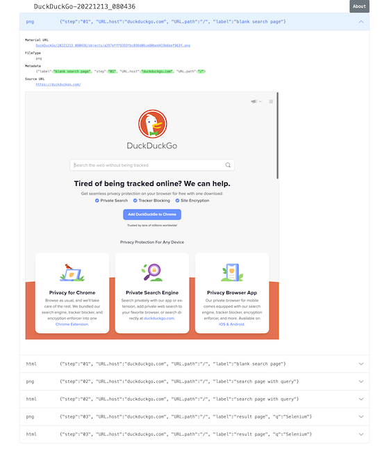

= Visual Inspection : Webサイトの画面確認を自動化しよう

== はじめに

わたしはWebアプリケーションのUIをテストとする作業をソフトウェアで自動化する技術に関心があります。わたしは2018年9月に下記の記事をQiitaに投稿しました。

* link:https://qiita.com/kazurayam/items/bcf72a03f50fc5db4373[Katalon StudioでVisual Testingを実現した]

このとき実装したプロジェクトは link:https://duckduckgo.com/?q=Katalon+Studio&atb=v314-1&ia=web[Katalon Studio]をベースにGroovy言語でスクリプトを書いて作った。この時の成果物にわたしは満足していませんでした。わたしは開発を続けて、ようやく使い物になるツールに仕立てることができた。このツールを _Visual Inspection_ と名付けました。ここでVisual Inspectionを紹介します。

== Visual Inspectionが出力するレポートのサンプル

Visual Inspectionを実行するとどういう出力が得られるのか？サンプルがあります。下記リンクをクリックして眺めてください。

- link:https://kazurayam.github.io/inspectus4katalon-sample-project/demo/store/index.html[store/index]

このサンプルをブラウザで開きあちこち眺める様子を動画にしてみました。

<iframe width="560" height="315" src="https://www.youtube.com/embed/pxZRS5-rigM" title="YouTube video player" frameborder="0" allow="accelerometer; autoplay; clipboard-write; encrypted-media; gyroscope; picture-in-picture" allowfullscreen></iframe>

== サンプルの説明

このレポートの見方をざっと説明しましょう。

=== 二つの画像の差分

ひとつ目のサンプルの、あるWebページのスクリーンショットを撮り、数秒後にもう一度スクリーンショットを撮って、二つの画像を比較するという検査の結果です。違っているピクセルが赤色に塗られる。標的にしたWebページ link:http://demoaut-mimic.kazurayam.com/[] には秒単位の現在時刻が表示されるのですが、１回目と２回目の間に適当な時間差をおけば時刻が変わるから、差分画像の中に赤い塗りつぶしがわずかながら生じます。こんなふうに：

image:https://kazurayam.github.io/inspectus4katalon-sample-project/images/Left-Diff-Right.png[]

あなたのWebサイトを標的としてVisual Inspectionを実施したら、どのページのどの箇所が赤くなるだろうか？ --- ぜひ自分で試してみてください。

=== 二つのテキストの差分

標的にしたWebページ link:http://demoaut-mimic.kazurayam.com/[] のDiffに赤い塗り潰しを見つけて「おや？どうしてこうなったんだ」と気づいたら、あなたは次に、WebページのHTMLソースコードのどこがどのように違っているのか、確かめたくなるでしょう。その疑問に即答するために、WebページのHTMLソースをブラウザから取り出して記録として保存しています。下記の画像は二つのHTMLのdiffを表示している例です。

image:https://kazurayam.github.io/inspectus4katalon-sample-project/images/HTMLsource_diff.png[]

HTMLソースコードだけでなく他のさまざまな形式のテキストを差分検査の対象とすることができます。JSON、XML、CSVといったデータ記述向きのテキストはもちろん、`.js` や `.css` のようなプログラム・コードも差分検査することができます。

=== スクリーンショットの一覧

自分が運営するwebサイトのスクリーンショットをたくさん撮って一覧を作りたい、差分検査はとりあえず要らない。そういうシンプルな要求を満たすための機能もサポートしています。次のデモを見てください。検索サイト link:https://duckduckgo.com/?[DuckDuckGo] をブラウザで開いて、キーワード `selenium` を指定してENTERし検索結果を見る。その過程で画面のスクリーンショットとHTMLソースを取得し保存する。最後に一覧をHTMLとして生成する。これだけのことをしたデモです。

* link:https://kazurayam.github.io/inspectus4katalon-sample-project/demo/store/DuckDuckGo-20221213_080436.html[DuckDuckGoのスクリーンショット一覧のデモ]

== Visual Inspectionのサンプル・プロジェクトを動かしてみる

前に紹介したサンプルを出力するプロジェクトをあなたのPCで動かしてみましょう。環境を準備することから始めましょう。あなたが Windows10 のPCを持っていてインターネットに接続可能であると前提します。ツール類を未だインストールしていないと前提して一から説明します。

=== Katalon Studioを準備する

==== Katalon Studio - Standalone Edition をインストールする

==== Katalon Studioを設定する

. Proxyを設定する（必要ならば）
. WebDriverをアップデートする
. Scripモードを使う、Manualモードを使わない

==== 初めてのプロジェクトを作り、プロジェクトを設定する

. ブラウザの種類を選ぶ
. Log Viewerを設定する
. TestOpsをintegrateしない
. TestCloudをintegrateしない
. Smart Waitを使わない

==== 初めてのTest Caseを作って動かしてみる

`openBrowser_navigateToUrl_closeBrowser`

これでひとまずKatalon Studioの設定が出来ました。

=== サンプル・プロジェクトを準備する

Visual Inspectionを実装したKatalon Studioプロジェクトのサンプルが下記のGitHubレポジトリにあります。

- link:https://github.com/kazurayam/inspectus4katalon-sample-project[]

link:https//qiita.com/[Qiita]の読者ならこのGitHubプロジェクトをgit cloneしてWindows PCで動かすことなど説明されるまでもなくできるでしょう。それでもいいのですが、ここではgitコマンドを使わないで、別の方法を紹介します。ビルドツール link:https://gradle.org/[Gradle] を使います。ただしそのやり方を実行するにはいくつか追加の準備が必要です。少し長いですが、やっていきましょう。

=== Git for Windowsをインストールする

* link:https://gitforwindows.org/[Git for Windows]

このサイトのdownloadボタンを押します。インストーラーがダウンロードできます。インストーラーを実行してください。すべてデフォルトの設定を選択するのでいい。インストールが完了すると `Git Bash` が使えるようになります。Git Bashを開いてください。

===

`MyVisualInspectionProject` フォルダの直下に `build.gradle` ファイルがある（はずです）。build.gradleを下記のように書き換えます。

[source, text]
----
plugins {
  id 'com.kazurayam.inspectus4katalon' version "0.3.4"
}
----

そしてKatalon Studioを一旦止めます。そしてコマンドラインで下記のようにコマンドを２つ、実行します。

[source, text]
----
$ cd MyVisualInspectionProject
$ gradle drivers
...
$ gradle deploy-visual-inspection-sample-for-katalon
...
----

このコマンドにより必要なサンプルコードが一揃いインターネット上のレポジトリからダウンロードされる。

Katalon Studioを再び起動してMayVisualInspectionプロジェクトを開くと、プロジェクトの中に新しいフォルダができて、中にスクリプトが入っている　。。。

