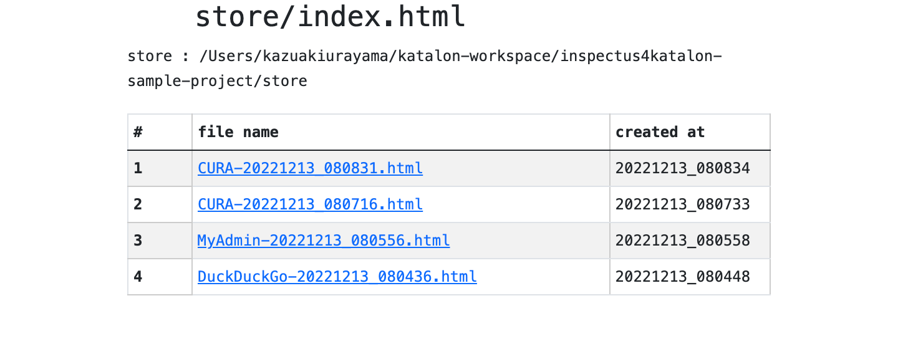

-   <a href="#inspectus4katalon-sample-project" id="toc-inspectus4katalon-sample-project">inspectus4katalon-sample-project</a>
    -   <a href="#demonstration" id="toc-demonstration">Demonstration</a>
        -   <a href="#index" id="toc-index">index</a>
        -   <a href="#shootings-demo-test-casesduckduckgo" id="toc-shootings-demo-test-casesduckduckgo">Shootings demo : "Test Cases/DuckDuckGo"</a>
        -   <a href="#chronosdiff-demo-test-casescura" id="toc-chronosdiff-demo-test-casescura">ChronosDiff demo: "Test Cases/CURA"</a>
        -   <a href="#twinsdiff-demo-test-casesmyadmin" id="toc-twinsdiff-demo-test-casesmyadmin">TwinsDiff demo: "Test Cases/MyAdmin"</a>
    -   <a href="#how-to-share-the-reports-in-the-team" id="toc-how-to-share-the-reports-in-the-team">How to share the reports in the team</a>
    -   <a href="#applicability-to-mobile-and-api-testing" id="toc-applicability-to-mobile-and-api-testing">Applicability to Mobile and API testing</a>

# inspectus4katalon-sample-project

-   @author kazurayam

-   @date Dec 2022

-   back to the [repository](https://github.com/kazurayam/inspectus4katalon-sample-project)

## Demonstration

### index

-   [store/index.html](https://kazurayam.github.io/inspectus4katalon-sample-project/demo/store/index.html)

this looks like this:

### Shootings demo : "Test Cases/DuckDuckGo"

-   The Test Case [DuckDuckGo/main](https://github.com/kazurayam/inspectus4katalon-sample-project/tree/master/Scripts/DuckDuckGo/main/Script1667437517277.groovy) visits a single Web site.

-   It navigates through the site for a few web pages.

-   It takes screenshots of the pages, save the images in PNG format. It also save the HTML sources.

-   It compiles a report in HTML where you can see a list of all files saved during the run.

Demo in action: [click here](https://kazurayam.github.io/inspectus4katalon-sample-project/demo/store/DuckDuckGo-20221213_080436.html)

The Test Case [DuckDuckGo/main](https://github.com/kazurayam/inspectus4katalon-sample-project/tree/master/Scripts/DuckDuckGo/main/Script1667437517277.groovy) sets up the parameters and calls the Test Case [DuckDuckGo/materialize](https://github.com/kazurayam/inspectus4katalon-sample-project/tree/master/Scripts/DuckDuckGo/materialize/Script1667437527092.groovy). The `main` testcase executes `com.kazurayam.inspectus.katalon.KatalonShootings` object, which performs all diffing and reporting tasks etc behind the scene.

The Test Case [DuckDuckGo/materialize](https://github.com/kazurayam/inspectus4katalon-sample-project/tree/master/Scripts/DuckDuckGo/materialize/Script1667437527092.groovy) is essentially an ordinary Katalon Studio’s test case. You are totally responsible which URL to open, how to navigate through, how to take screenshots, how to write the files. It is required to write the files into the `store` object. See [materialstore tutorial](https://kazurayam.github.io/materialstore-tutorial/) for more information of the API.

You can run the test case [Test Case/DuckDuckGo/run\_materialize](https://github.com/kazurayam/inspectus4katalon-sample-project/tree/master/Scripts/DuckDuckGo/run_materialize/Script1667616595404.groovy) to test the `DuckDuckGo/materialize` on its own.

### ChronosDiff demo: "Test Cases/CURA"

-   The Test Case [CURA/main](https://github.com/kazurayam/inspectus4katalon-sample-project/tree/master/Scripts/CURA/main/Script1667709715867.groovy) visits a single Web site

-   You want to run Test Case "CURA/main" twice. You may wait for some period (some seconds, minutes, hours, days, …​) as long as you want. You should determine how large the chronological gap should be; you are to determine when to run the 2nd time.

-   It navigates through the site for a few web pages.

-   It takes screenshots of the pages, save the images in PNG format. It also save the HTML sources.

-   It compiles a report in HTML where you find multiple sets of **Previous** / **Diff** / **Current** images & HTMLs of the web site taken at different timing.

-   The current screenshots are compared to the latest previous set as default. But you can specify the baseline by a single line of code. For example, you can compare the current to the one that were taken 30 minutes ago; or to the one taken at 3 hours ago; or to the one taken at 18PM last night; or to the one taken last in the last month.

-   By Chronos-Diff, you can compare the pages of a single Web site at different timing. By Chronos-diff, you can make sure if the Web site is healthy after a work that involves some
    changes in software, database, hardware and/or network.

Demo in action:

-   [1st run](https://kazurayam.github.io/inspectus4katalon-sample-project/demo/store/CURA-20221213_080716.html) --- all pages shows significant difference because there were no "previous" records avaiable.

-   [2nd run](https://kazurayam.github.io/inspectus4katalon-sample-project/demo/store/CURA-20221213_080831.html) --- all pages shows very little difference because the target web site changed very little, as the demonstration ran the "CURA/main" twice with just a few seconds of intermission.

The Test Case [CURA/main](https://github.com/kazurayam/inspectus4katalon-sample-project/tree/master/Scripts/CURA/main/Script1667709715867.groovy) sets up the parameters and calls the Test Case [CURA/materialize](https://github.com/kazurayam/inspectus4katalon-sample-project/tree/master/Scripts/CURA/materialize/Script1667709728945.groovy). The `main` testcase executes `com.kazurayam.inspectus.katalon.KatalonChronosDiff` object, which performs all diffing and reporting tasks etc behind the scene.

The Test Case [CURA/materialize](https://github.com/kazurayam/inspectus4katalon-sample-project/tree/master/Scripts/CURA/materialize/Script1667709728945.groovy) is essentially an ordinary Katalon Studio’s test case. You are totally responsible which URL to open, how to navigate through, how to take screenshots, how to write the files. It is required to write the files into the `store` object. See [materialstore tutorial](https://kazurayam.github.io/materialstore-tutorial/) for more information of the API.

You can run the test case [Test Case/CURA/run\_materialize](https://github.com/kazurayam/inspectus4katalon-sample-project/tree/master/Scripts/CURA/run_materialize/Script1667709743309.groovy) to test the `DuckDuckGo/materialize` on its own.

### TwinsDiff demo: "Test Cases/MyAdmin"

-   The Test Case [MyAdmin/main](https://github.com/kazurayam/inspectus4katalon-sample-project/tree/master/Scripts/MyAdmin/main/Script1667687348266.groovy) visits 2 Web sites.

-   The URLs of the 2 sites have **different hostnames (myadmin.kazurayam.com and devadmin.kazurayam.com) but shares a single sitemap** (file tree). Typically, you would want to compare the Production environment and Development environment of a Web site.

-   It navigates through the site for multiple pages.

-   It reads [a CSV file](https://github.com/kazurayam/inspectus4katalon-sample-project/tree/master/Include/data/MyAdmin/targetList.csv) to know the sitemap (= list of URLs) to process.

-   It processes 2 Web sites sequentially as soon as possible without putting time gap.

-   It takes screenshots of the pages, save the images in PNG format. It also save the HTML sources.

-   It compiles a report in HTML where you find multiple sets of **Left** / **Diff** / **Right** images & HTMLs.

-   By Twins-Diff, you can compare the Production environment and the Development environment. This method is effective to identify any regressions or unexpected changes caused by the development works that continues every day.

Demo in action: [click here](https://kazurayam.github.io/inspectus4katalon-sample-project/demo/store/MyAdmin-20221213_080556.html)

The Test Case [MyAdmin/main](https://github.com/kazurayam/inspectus4katalon-sample-project/tree/master/Scripts/MyAdmin/main/Script1667687348266.groovy) sets up the parameters and calls the Test Case [MyAdmin/materialize](https://github.com/kazurayam/inspectus4katalon-sample-project/tree/master/Scripts/MyAdmin/materialize/Script1667687365090.groovy). The `main` testcase executes `com.kazurayam.inspectus.katalon.KatalonTwinsDiff` object, which performs all diffing and reporting tasks etc behind the scene.

The Test Case [MyAdmin/materialize](https://github.com/kazurayam/inspectus4katalon-sample-project/tree/master/Scripts/MyAdmin/materialize/Script1667687365090.groovy) is essentially an ordinary Katalon Studio’s test case. You are totally responsible which URL to open, how to navigate through, how to take screenshots, how to write the files. It is required to write the files into the `store` object. See [materialstore tutorial](https://kazurayam.github.io/materialstore-tutorial/) for more information of the API.

You can run the test case [Test Case/MyAdmin/run\_materialize](https://github.com/kazurayam/inspectus4katalon-sample-project/tree/master/Scripts/MyAdmin/run_materialize/Script1667687380074.groovy) to test the \` MyAdmin/materialize\` on its own.

## How to share the reports in the team

This demo project creates 2 local directory `store` and `store-backup` immediately under the project’s root directory.

Both of them will have `index.html` where most recent updates are listed first.

The `store` directory should be there on the local disk for ultimate processing speed.

On the other hand, the `store-backup` directory is less frequently accessed. So that you can locate the `store-backup` on a drive-mounted shared file server. Or you may want to mirror the `store-backup` folder on Cloud storage (AWS S3, Google Drive, etc) using some [tools](https://cyberduck.io/s3/) that map cloud storage to local drive.

Your team can share the remote `store-backup` via Windows Explorer. Also you would be able to host the `store-backup` as a `http://` resource shared amongst your organization. It would be the cheapest solution for reporting the test result to anybody who may concern.

## Applicability to Mobile and API testing

This sample project demonstrates how to take screenshot out of web browser, do diffing and reporting. But it can be applied to Mobile and API testing as well.

The "Visual Inspection" project works on top of 2 external libraries:

-   [com.kazurayam.materialstore](https://github.com/kazurayam/materialstore)

-   [com.kazurayam.inspectus](https://github.com/kazurayam/inspectus)

These libraries are NOT dependent on neither of [Katalon Studio API](https://api-docs.katalon.com/overview-summary.html) nor [Selenium WebDriver](https://www.selenium.dev/documentation/webdriver/) API. These will accept any type of files regardless how they were created, for example

-   as screenshot of Web browser

-   as screenshot of Mobile app

-   as files downloaded from RESTful API

So "Visual Inspection" is not limited by the type of Application Under Test.

It is the testers' responsibility to create files in the "materialize" Test Case. The testers can create whatever files by whatever method. The "materialstore" library will quietly accept any files created by their "materialize" test case, and will do diffing and reporting.
