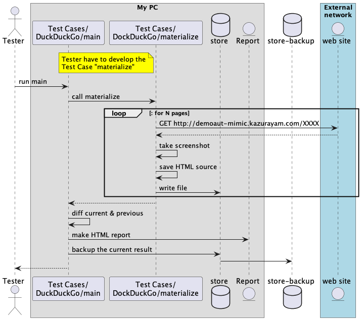
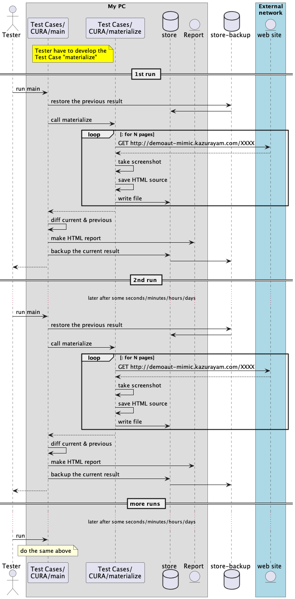
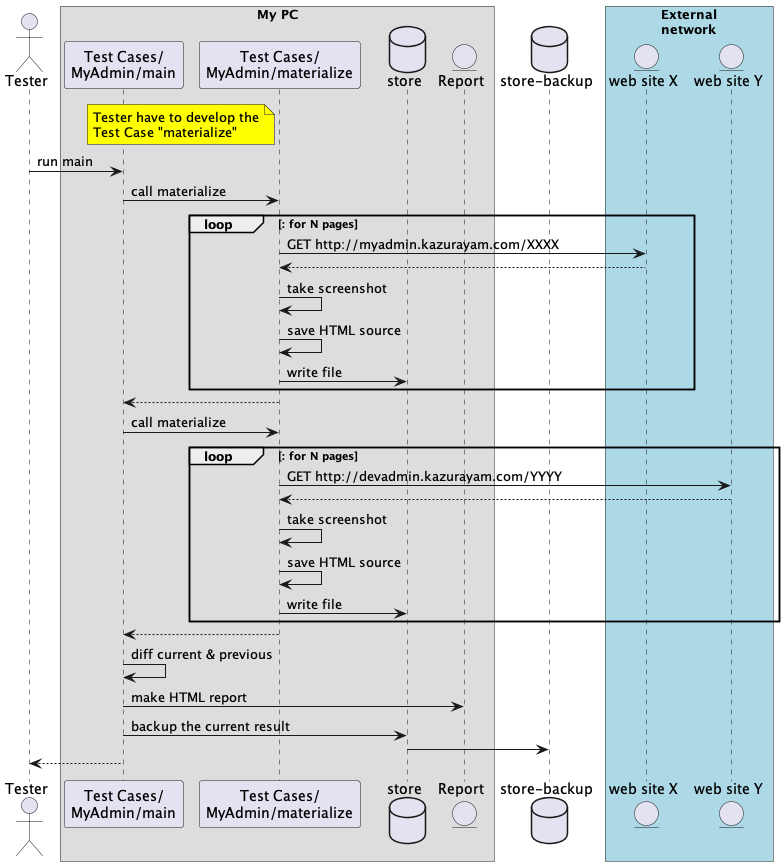

= inspectus4katalon-sample-project

* back to the link:https://kazurayam.github.io/inspectus4katalon-sample-project/[repository]

== Demonstration

=== index

* link:https://kazurayam.github.io/inspectus4katalon-sample-project/demo/store/index.html[store/index.html]

=== How "Test Cases/DuckDuckGo" works

* It visits a single Web site.
* It navigates through the site for a few web pages.
* It takes screenshots of the pages, save the images in PNG format. It also save the HTML sources.
* It compiles a report in HTML where you can see a list of all files saved during the run.

Demo in action: link:https://kazurayam.github.io/inspectus4katalon-sample-project/demo/store/DuckDuckGo-20221213_080436.html[click here]

The Test Case link:../Scripts/DuckDuckGo/main/Script1667437517277.groovy[DuckDuckGo/main] set up the parameters and calls the Test Case link:../Scripts/DuckDuckGo/materialize/Script1667437527092.groovy[DuckDuckGo/materialize]. The `main` testcase executes `com.kazurayam.inspectus.katalon.KatalonShootings` object, which performs all diffing and reporting tasks etc behind the scene.

The Test Case link:../Scripts/DuckDuckGo/materialize/Script1667437527092.groovy[DuckDuckGo/materialize] is essentially an ordinary Katalon Studio's test case. You are totally responsible which URL to open, how to navigate through, how to take screenshots, how to write the files. It is required to write the files into the `store` object. See link:https://kazurayam.github.io/materialstore-tutorial/[materialstore tutorial] for more information of the API.

You can run the test case link:../Scripts/DuckDuckGo/run_materialize/Script1667616595404.groovy[Test Case/DuckDuckGo/run_materialize] to test the `DuckDuckGo/materialize` on its own.

=== How "Test Cases/CURA" works

* It visits a single Web site
* You want to run Test Case "CURA/main" twice. You may wait for some duration (seconds, minutes, hours, ...) as long as you want. You should determine how large the chronological gap should be; you are to determine when to run the 2nd time.
* It navigates through the site for a few web pages.
* It takes screenshots of the pages, save the images in PNG format. It also save the HTML sources.
* It compiles a report in HTML where you find multiple sets of *Previous* / *Diff* / *Current* images & HTMLs of the web site taken at different timing.
* By Chronos-Diff, you can compare the pages of a single Web site at different timing. You can make sure if your Web application is healthy after certain changes in any portion of software/hardware/network.

Demo in action:

* link:https://kazurayam.github.io/inspectus4katalon-sample-project/demo/store/CURA-20221213_080716.html[1st run]

* link:https://kazurayam.github.io/inspectus4katalon-sample-project/demo/store/CURA-20221213_080831.html[2nd run]

The Test Case link:../Scripts/CURA/main/Script1667709715867.groovy[CURA/main] set up the parameters and calls the Test Case link:../Scripts/CURA/materialize/Script1667709728945.groovy[CURA/materialize]. The `main` testcase executes `com.kazurayam.inspectus.katalon.KatalonChronosDiff` object, which performs all diffing and reporting tasks etc behind the scene.

The Test Case link:../Scripts/CURA/materialize/Script1667709728945.groovy[CURA/materialize] is essentially an ordinary Katalon Studio's test case. You are totally responsible which URL to open, how to navigate through, how to take screenshots, how to write the files. It is required to write the files into the `store` object. See link:https://kazurayam.github.io/materialstore-tutorial/[materialstore tutorial] for more information of the API.

You can run the test case link:../Scripts/CURA/run_materialize/Script1667709743309.groovy[Test Case/CURA/run_materialize] to test the `DuckDuckGo/materialize` on its own.

=== How "Test Cases/MyAdmin" works

* It visits 2 Web sites which have the same sitemap; namely Production environment and Development environment.
* It navigates through the site for multiple pages.
* It reads a CSV file to know the list of URLs to process.
* It processes 2 Web sites sequentially as soon as possible without putting any time gap.
* It takes screenshots of the pages, save the images in PNG format. It also save the HTML sources.
* It compiles a report in HTML where you find multiple sets of *Previous* / *Diff* / *Current* images & HTMLs of the web site taken at almost the same timing.
* By Twins-Diff, you can compare the Production environment and the Development environment.

Demo in action: link:https://kazurayam.github.io/inspectus4katalon-sample-project/demo/store/MyAdmin-20221213_080556.html[click here]

The Test Case link:../Scripts/MyAdmin/main/Script1667687348266.groovy[MyAdmin/main] set up the parameters and calls the Test Case link:../Scripts/MyAdmin/materialize/Script1667687365090.groovy[MyAdmin/materialize]. The `main` testcase executes `com.kazurayam.inspectus.katalon.KatalonTwinsDiff` object, which performs all diffing and reporting tasks etc behind the scene.

The Test Case link:../Scripts/MyAdmin/materialize/Script1667687365090.groovy[MyAdmin/materialize] is essentially an ordinary Katalon Studio's test case. You are totally responsible which URL to open, how to navigate through, how to take screenshots, how to write the files. It is required to write the files into the `store` object. See link:https://kazurayam.github.io/materialstore-tutorial/[materialstore tutorial] for more information of the API.

You can run the test case link:../Scripts/MyAdmin/run_materialize/Script1667687380074.groovy[Test Case/MyAdmin/run_materialize] to test the ` MyAdmin/materialize` on its own.

