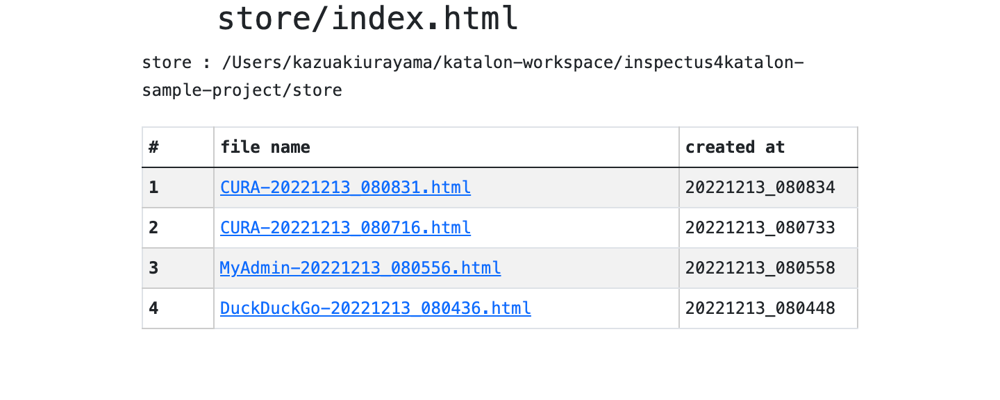

= inspectus4katalon-sample-project

* back to the link:https://github.com/kazurayam/inspectus4katalon-sample-project[repository]

== Demonstration

=== index

* link:https://kazurayam.github.io/inspectus4katalon-sample-project/demo/store/index.html[store/index.html]

this looks like this:

=== How "Test Cases/DuckDuckGo" works

* The Test Case link:https://github.com/kazurayam/inspectus4katalon-sample-project/tree/master/Scripts/DuckDuckGo/main/Script1667437517277.groovy[DuckDuckGo/main] visits a single Web site.
* It navigates through the site for a few web pages.
* It takes screenshots of the pages, save the images in PNG format. It also save the HTML sources.
* It compiles a report in HTML where you can see a list of all files saved during the run.

Demo in action: link:https://kazurayam.github.io/inspectus4katalon-sample-project/demo/store/DuckDuckGo-20221213_080436.html[click here]

image::diagrams/out/shootings/shootings.png[]

The Test Case link:https://github.com/kazurayam/inspectus4katalon-sample-project/tree/master/Scripts/DuckDuckGo/main/Script1667437517277.groovy[DuckDuckGo/main] sets up the parameters and calls the Test Case link:https://github.com/kazurayam/inspectus4katalon-sample-project/tree/master/Scripts/DuckDuckGo/materialize/Script1667437527092.groovy[DuckDuckGo/materialize]. The `main` testcase executes `com.kazurayam.inspectus.katalon.KatalonShootings` object, which performs all diffing and reporting tasks etc behind the scene.

The Test Case link:https://github.com/kazurayam/inspectus4katalon-sample-project/tree/master/Scripts/DuckDuckGo/materialize/Script1667437527092.groovy[DuckDuckGo/materialize] is essentially an ordinary Katalon Studio's test case. You are totally responsible which URL to open, how to navigate through, how to take screenshots, how to write the files. It is required to write the files into the `store` object. See link:https://kazurayam.github.io/materialstore-tutorial/[materialstore tutorial] for more information of the API.

You can run the test case link:https://github.com/kazurayam/inspectus4katalon-sample-project/tree/master/Scripts/DuckDuckGo/run_materialize/Script1667616595404.groovy[Test Case/DuckDuckGo/run_materialize] to test the `DuckDuckGo/materialize` on its own.

=== How "Test Cases/CURA" works

* The Test Case link:https://github.com/kazurayam/inspectus4katalon-sample-project/tree/master/Scripts/CURA/main/Script1667709715867.groovy[CURA/main] visits a single Web site
* You want to run Test Case "CURA/main" twice. You may wait for some period (some seconds, minutes, hours, days, ...) as long as you want. You should determine how large the chronological gap should be; you are to determine when to run the 2nd time.
* It navigates through the site for a few web pages.
* It takes screenshots of the pages, save the images in PNG format. It also save the HTML sources.
* It compiles a report in HTML where you find multiple sets of *Previous* / *Diff* / *Current* images & HTMLs of the web site taken at different timing.
* You can specify, as the runtime parameter, the baseline to which the current screenshots are to be compared. For example, the very last previous one, or the previous one prior to the current timestamp minus 3 hours.
* By Chronos-Diff, you can compare the pages of a single Web site at different timing. By Chronos-diff, you can make sure if the Web site is healthy after a work that involves any
 changes in software, database, hardware and/or network.

Demo in action:

* link:https://kazurayam.github.io/inspectus4katalon-sample-project/demo/store/CURA-20221213_080716.html[1st run] --- all pages shows significant difference because there were no "previous" records avaiable.

* link:https://kazurayam.github.io/inspectus4katalon-sample-project/demo/store/CURA-20221213_080831.html[2nd run] --- all pages shows very little difference because the target web site changed very little, as the demonstration ran the "CURA/main" twice with just a few seconds of intermission.

image::diagrams/out/chronos-diff/chronos-diff.png[]

The Test Case link:https://github.com/kazurayam/inspectus4katalon-sample-project/tree/master/Scripts/CURA/main/Script1667709715867.groovy[CURA/main] sets up the parameters and calls the Test Case link:https://github.com/kazurayam/inspectus4katalon-sample-project/tree/master/Scripts/CURA/materialize/Script1667709728945.groovy[CURA/materialize]. The `main` testcase executes `com.kazurayam.inspectus.katalon.KatalonChronosDiff` object, which performs all diffing and reporting tasks etc behind the scene.

The Test Case link:https://github.com/kazurayam/inspectus4katalon-sample-project/tree/master/Scripts/CURA/materialize/Script1667709728945.groovy[CURA/materialize] is essentially an ordinary Katalon Studio's test case. You are totally responsible which URL to open, how to navigate through, how to take screenshots, how to write the files. It is required to write the files into the `store` object. See link:https://kazurayam.github.io/materialstore-tutorial/[materialstore tutorial] for more information of the API.

You can run the test case link:https://github.com/kazurayam/inspectus4katalon-sample-project/tree/master/Scripts/CURA/run_materialize/Script1667709743309.groovy[Test Case/CURA/run_materialize] to test the `DuckDuckGo/materialize` on its own.

=== How "Test Cases/MyAdmin" works

* The Test Case link:https://github.com/kazurayam/inspectus4katalon-sample-project/tree/master/Scripts/MyAdmin/main/Script1667687348266.groovy[MyAdmin/main] visits 2 Web sites.
* The URLs of the 2 sites have *different hostnames (myadmin.kazurayam.com and devadmin.kazurayam.com) but shares a single sitemap* (file tree). Typically, you would want to compare the  Production environment and Development environment of a Web site.
* It navigates through the site for multiple pages.
* It reads link:https://github.com/kazurayam/inspectus4katalon-sample-project/tree/master/Include/data/MyAdmin/targetList.csv[a CSV file] to know the sitemap (= list of URLs) to process.
* It processes 2 Web sites sequentially as soon as possible without putting time gap.
* It takes screenshots of the pages, save the images in PNG format. It also save the HTML sources.
* It compiles a report in HTML where you find multiple sets of *Previous* / *Diff* / *Current* images & HTMLs.
* By Twins-Diff, you can compare the Production environment and the Development environment. This method is effective to identify any regressions or unexpected changes injected by the continuous development.

Demo in action: link:https://kazurayam.github.io/inspectus4katalon-sample-project/demo/store/MyAdmin-20221213_080556.html[click here]

image::diagrams/out/twins-diff/twins-diff.png[]

The Test Case link:https://github.com/kazurayam/inspectus4katalon-sample-project/tree/master/Scripts/MyAdmin/main/Script1667687348266.groovy[MyAdmin/main] sets up the parameters and calls the Test Case link:https://github.com/kazurayam/inspectus4katalon-sample-project/tree/master/Scripts/MyAdmin/materialize/Script1667687365090.groovy[MyAdmin/materialize]. The `main` testcase executes `com.kazurayam.inspectus.katalon.KatalonTwinsDiff` object, which performs all diffing and reporting tasks etc behind the scene.

The Test Case link:https://github.com/kazurayam/inspectus4katalon-sample-project/tree/master/Scripts/MyAdmin/materialize/Script1667687365090.groovy[MyAdmin/materialize] is essentially an ordinary Katalon Studio's test case. You are totally responsible which URL to open, how to navigate through, how to take screenshots, how to write the files. It is required to write the files into the `store` object. See link:https://kazurayam.github.io/materialstore-tutorial/[materialstore tutorial] for more information of the API.

You can run the test case link:https://github.com/kazurayam/inspectus4katalon-sample-project/tree/master/Scripts/MyAdmin/run_materialize/Script1667687380074.groovy[Test Case/MyAdmin/run_materialize] to test the ` MyAdmin/materialize` on its own.

== The "store" and "store-backup"

This demo project creates 2 local directory `store` and `store-backup` immediately under the project's root directory.

Both of them will have `index.html` where most recent updates are listed first.

The `store` directory should be there on the local disk for ultimate processing speed.

On the other hand, the `store-backup` directory is less frequently accessed. So that you can locate the `store-backup` on a drive-mounted shared file server. Or you may want to mirror the `store-backup` folder on Cloud storage (AWS S3, Google Driver, etc) using some link:https://www.expandrive.com/s3-drive-mac-windows/[tools] that map cloud storage to local drive.

Your team can share the remote `store-backup` via Windows Explorer. Also you would be able to host the `store-backup` as a `http://` resource shared amongst your organization. It would be a cheapest solution for reporting the test result to anybody who may concern.

